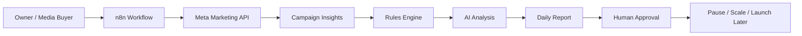

# Meta Ads AI Automation Starter Kit

A practical starter kit for connecting Meta Ads reporting with AI analysis and n8n automation.

This project teaches how to build an approval-first ads automation system that can:

- Pull Meta Ads performance data.
- Analyze ads with AI.
- Flag losing ads.
- Suggest budget changes.
- Generate daily reports.
- Prepare campaign ideas from brand context.
- Keep humans in control before changing live campaigns.

The example brand context is based on Waikato Coffee:

- Instagram: https://www.instagram.com/waikato.coffee/
- TikTok: https://www.tiktok.com/@waikatocoffee?lang=en-GB

## Who This Is For

- Small business owners
- Media buyers
- Marketing freelancers
- AI automation builders
- n8n beginners
- Creators who want to teach practical AI workflows

## What You Get

1. `docs/01-meta-setup.md`  
   How to prepare Meta Business Manager, Marketing API, and your ad account.

2. `docs/02-n8n-setup.md`  
   How to import the workflow into n8n Cloud.

3. `docs/03-security-and-approval.md`  
   Safety rules for handling ad spend and API tokens.

4. `docs/04-automation-ops.md`  
   Daily operating process for reviewing reports and approving actions.

5. `docs/05-profile-and-brand-context.md`  
   How to write a brand profile so AI understands the business.

6. `docs/06-teach-this-workflow.md`  
   A simple content plan for teaching this automation on GitHub, YouTube, TikTok, or LinkedIn.

7. `n8n/meta-ads-ai-automation.workflow.json`  
   Importable n8n workflow template.

8. `prompts/ad-ops-system-prompt.md`  
   AI media buyer prompt.

9. `prompts/campaign-builder-prompt.md`  
   Prompt for building a campaign from URL, budget, and offer.

10. `config/rules.example.json`  
    Example rules for pausing, reviewing, and scaling ads.

## Recommended Workflow Mode

Start with:

```text
report_only
```

This means the workflow only analyzes and recommends. It does not change live ads.

After 3 stable days, move to:

```text
approval_required
```

Avoid direct live automation until your data, rules, and approvals are tested.

## Architecture



## Important

Do not commit API keys, access tokens, ad account IDs, client data, or billing information to GitHub.

Use n8n credentials for secrets.

## Official References

- Meta Marketing API: https://developers.facebook.com/docs/marketing-api/
- Meta Ads Insights API: https://developers.facebook.com/docs/marketing-api/insights/
- n8n Docs: https://docs.n8n.io/
